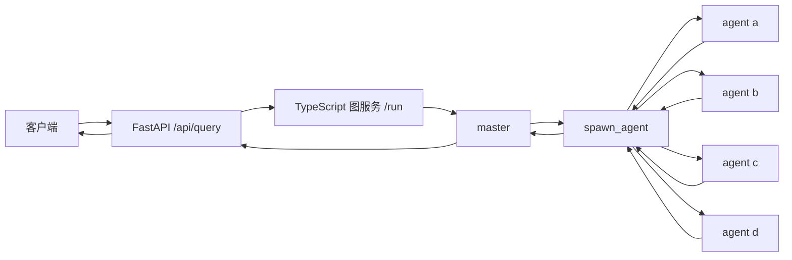

# Multi-Agent Assistance System

基于 TypeScript、LangGraph 和 FastAPI 的多 Agent 后端骨架。用户请求先进入 `master`；`master` 通过 `spawn_agent` 工具选择 `a`、`b`、`c`、`d` 中的一个或多个 Agent，并为每个 Agent 传入独立任务文本。子 Agent 的结果返回 `master`，由它生成最终回答。模型由 LangChain 的 `initChatModel` 按 `provider:model` 标识加载对应 provider SDK。

当前版本只定义运行链路、数据契约和代码边界。**没有编写 master 或子 Agent 的系统提示词，也没有分配 A–D 的业务职责。**

## 架构



- **FastAPI** 是对外 HTTP 入口，负责请求校验、响应模型和图服务错误映射。
- **TypeScript 图服务** 通过本机 HTTP 接收请求，运行 LangGraph，并返回结构化结果。
- **master 图** 包含 `master → spawn → finish` 三个节点。`master` 必须调用一次 `spawn_agent`；工具一次可选择 1–4 个不同 Agent。`finish` 接收工具结果并生成回答。
- **子 Agent** 各有独立文件和 LangGraph 工作流。每次调用只接收分配给自己的任务文本，不共享其他子 Agent 的上下文；同一次 `spawn_agent` 中的任务并发执行。

这采用 LangChain 文档中的 [单一分发工具与子 Agent 隔离模式](https://docs.langchain.com/oss/javascript/langchain/multi-agent/subagents#single-dispatch-tool)，图节点和边使用 [LangGraph Graph API](https://docs.langchain.com/oss/javascript/langgraph/quickstart#use-the-graph-api)。

## 目录

```text
api/main.py              FastAPI 对外 API
src/server.ts            TypeScript 图服务 HTTP 入口
src/model.ts             模型创建与环境变量
src/types.ts             请求、分配任务和结果契约
src/agents/master.ts     master 图与 spawn_agent 工具
src/agents/registry.ts   Agent 注册表
src/agents/worker.ts     子 Agent 共用的最小 LangGraph 工作流
src/agents/a.ts          Agent A 扩展入口
src/agents/b.ts          Agent B 扩展入口
src/agents/c.ts          Agent C 扩展入口
src/agents/d.ts          Agent D 扩展入口
tests/                  图流程与 API 契约测试
```

## 本地运行

需要 Node.js 20+、Python 3.11+，以及支持指定工具调用的聊天模型。

1. 安装依赖：

   ```bash
   npm ci
   python3 -m venv .venv
   source .venv/bin/activate
   pip install -r requirements.txt
   ```

2. 配置模型。可参考 `.env.example`；按所选 provider 设置模型标识和密钥：

   ```bash
   export CHAT_MODEL="openai:gpt-4.1-mini"
   export OPENAI_API_KEY="你的密钥"
   ```

   已安装 OpenAI、Anthropic 和 Google GenAI 的 provider SDK。例如可改为 `CHAT_MODEL="anthropic:<模型名>"` 并设置 `ANTHROPIC_API_KEY`，或改为 `CHAT_MODEL="google-genai:<模型名>"` 并设置 `GOOGLE_API_KEY`。`OPENAI_BASE_URL` 仅在 `CHAT_MODEL` 使用 `openai:` 前缀时生效，可连接遵循 OpenAI 接口的服务。所选模型需要支持 `spawn_agent` 的指定工具调用。更多 provider 可按 [LangChain 模型文档](https://docs.langchain.com/oss/javascript/concepts/providers-and-models#one-api-for-any-model) 安装对应集成包，再设置 `CHAT_MODEL`。

3. 启动图服务：

   ```bash
   npm run dev:graph
   ```

4. 在另一个终端启动 FastAPI：

   ```bash
   source .venv/bin/activate
   uvicorn api.main:app --reload --host 127.0.0.1 --port 8000
   ```

5. 发送请求：

   ```bash
   curl -X POST http://127.0.0.1:8000/api/query \
     -H 'Content-Type: application/json' \
     -d '{"query":"你的问题"}'
   ```

返回格式：

```json
{
  "answer": "master 的回答",
  "agents": [
    { "agent": "a", "prompt": "master 分配的任务", "output": "Agent A 的结果" }
  ]
}
```

`GET /health` 会检查图服务是否可用。FastAPI 默认连接 `http://127.0.0.1:3001`；可用 `GRAPH_SERVICE_URL` 修改。图服务监听地址和端口分别由 `GRAPH_HOST`、`GRAPH_PORT` 控制，默认仅监听本机。

## 后续职责划分

- 在 `src/agents/a.ts` 至 `d.ts` 中分别实现各 Agent 的职责、工具和工作流；`registry.ts` 保持统一的 `(prompt) => Promise<string>` 调用契约。
- 在确定职责后，再补充对应的系统提示词和工具描述。当前只有 `spawn_agent` 的参数说明，供模型按 `a`–`d` 选择目标并提供各自的任务文本。
- 更换已安装的模型提供商时只需修改 `CHAT_MODEL` 和对应凭据；模型创建逻辑集中在 `src/model.ts`。

当前请求独立执行，没有跨请求会话记忆或持久化检查点；后续如需多轮会话，可以在图服务层增加 LangGraph checkpointer 和会话 ID。

## 验证

```bash
npm run typecheck
npm test
npm run build
python3 -m unittest discover -s tests -p 'test_*.py'
```

图流程测试使用模拟模型，不需要 API 密钥。真实模型的端到端调用需要先配置模型凭据。
