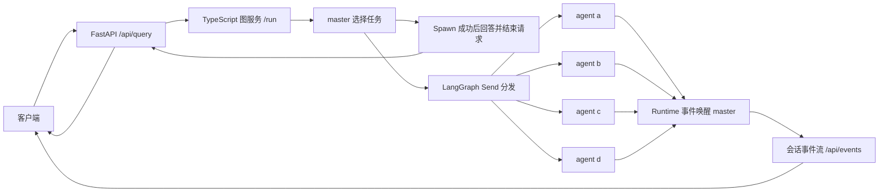

# Multi-Agent Assistance System

基于 TypeScript、LangGraph 和 FastAPI 的多 Agent 后端骨架。用户请求先进入 `master`；它可以直接回答，也可以通过 `spawn_agent` 工具选择 `a`、`b`、`c`、`d` 中的一个或多个 Agent，并为每个 Agent 传入独立任务文本。Spawn 立即返回成功状态，master 据此再调用一次模型回答用户，然后结束当前请求。子 Agent 后续完成时，Runtime 事件会再次唤醒 master；结果和后续回答通过独立的会话事件流发送给客户端。模型由 LangChain 的 `initChatModel` 按 `provider:model` 标识加载对应 provider SDK。

当前版本只定义运行链路、数据契约和代码边界。**没有编写 master 或子 Agent 的系统提示词，也没有分配 A–D 的业务职责。**

## 架构



- **FastAPI** 是对外 HTTP 入口，负责请求校验和转发请求与会话的 SSE 事件流。
- **TypeScript 图服务** 通过本机 HTTP 接收请求，运行 LangGraph，并逐步发送事件。
- **master 图** 包含任务选择与回答节点，并通过 LangGraph checkpointer 保存会话历史。`spawn_agent` 是可选工具；调用时可选择 1–4 个不同 Agent。Spawn 的工具返回值是 `{"status":"spawned","agents":[...]}`，master 收到该结果后完成一次回答。后续 Runtime 事件再次启动图的一次执行。
- **子 Agent 运行图** 使用 LangGraph `Send` 为每个选中的 Agent 创建独立并行任务，由图运行时调度。每个 Agent 各有独立文件和 LangGraph 工作流，只接收分配给自己的任务文本，不共享其他 Agent 的上下文。

### 运行语义

`master` 的图实例在 TypeScript 服务启动时创建，并在服务运行期间持续接收用户请求和 Runtime 事件。每次请求都先由 `master` 决定是否分配任务；选中的子 Agent 通过 `Send` 并发启动，各自只接收一份任务文本。通信方向是 master 分配任务给子 Agent、子 Agent 完成后发送 Runtime 事件；子 Agent 之间没有通信通道。Spawn 成功后，master 再调用一次模型回答用户，随后 `/api/query` 的 SSE 发送 `done` 并关闭。此时子 Agent 可以继续运行，但 master 不等待、不轮询，也不再消耗模型推理资源。每个子 Agent 完成或失败时，Runtime 事件会自动触发 master 的一次新执行，产生 `runtime_answer`。外部系统也可通过 `/api/runtime/events` 发送事件。查询完成得很快时，子 Agent 的事件也会在 `done` 之后处理。

`master` 使用 LangGraph checkpointer 按 `session_id` 保存对话历史。同一会话的用户请求和 Runtime 事件依次处理；上一轮的子 Agent 仍在运行时，新 query 已可进入 master。Runtime 事件处理后，事件内容和 master 的回答都会写入历史，供之后的调用使用。如果新 query 先于事件处理，则当时看不到该结果。不同会话互相隔离并可并发处理。子 Agent 始终只获得本次分配的任务文本，不读取 master 的历史。

新 query 进入 master 时，运行时会读取该会话仍在工作的子 Agent，并在本次模型输入的最末尾追加状态。例如 A 和 D 尚未完成时，末行是 `Sub agents A and D are still running`。完成的 Agent 会从状态中移除；全部完成时不追加状态行。这行状态只用于本次模型调用，保存到会话历史中的仍是用户原始 query。

这采用 LangChain 文档中的 [单一分发工具与子 Agent 隔离模式](https://docs.langchain.com/oss/javascript/langchain/multi-agent/subagents#single-dispatch-tool)，并使用 LangGraph 的 [Send 并行分发](https://docs.langchain.com/oss/javascript/langgraph/workflows-agents) 与 [Graph API](https://docs.langchain.com/oss/javascript/langgraph/quickstart#use-the-graph-api)。

## 目录

```text
api/main.py              FastAPI 对外 API
src/server.ts            TypeScript 图服务 HTTP 入口
src/model.ts             模型创建与环境变量
src/types.ts             请求、分配任务和结果契约
src/agents/master.ts     master 图与 spawn_agent 工具
src/agents/registry.ts   Agent 注册表
src/agents/worker.ts     子 Agent 共用的最小 LangGraph 工作流
src/agents/a.ts          Agent A 扩展入口
src/agents/b.ts          Agent B 扩展入口
src/agents/c.ts          Agent C 扩展入口
src/agents/d.ts          Agent D 扩展入口
tests/                  图流程与 API 契约测试
```

## 本地运行

需要 Node.js 20+、Python 3.11+，以及支持工具调用的聊天模型。

1. 安装依赖：

   ```bash
   npm ci
   python3 -m venv .venv
   source .venv/bin/activate
   pip install -r requirements.txt
   ```

2. 配置模型。可参考 `.env.example`；按所选 provider 设置模型标识和密钥：

   ```bash
   export CHAT_MODEL="openai:gpt-4.1-mini"
   export OPENAI_API_KEY="你的密钥"
   ```

   已安装 OpenAI、Anthropic 和 Google GenAI 的 provider SDK。例如可改为 `CHAT_MODEL="anthropic:<模型名>"` 并设置 `ANTHROPIC_API_KEY`，或改为 `CHAT_MODEL="google-genai:<模型名>"` 并设置 `GOOGLE_API_KEY`。`OPENAI_BASE_URL` 仅在 `CHAT_MODEL` 使用 `openai:` 前缀时生效，可连接遵循 OpenAI 接口的服务。更多 provider 可按 [LangChain 模型文档](https://docs.langchain.com/oss/javascript/concepts/providers-and-models#one-api-for-any-model) 安装对应集成包，再设置 `CHAT_MODEL`。

3. 启动图服务：

   ```bash
   npm run dev:graph
   ```

4. 在另一个终端启动 FastAPI：

   ```bash
   source .venv/bin/activate
   uvicorn api.main:app --reload --host 127.0.0.1 --port 8000
   ```

5. 发送请求：

   ```bash
   curl -N -X POST http://127.0.0.1:8000/api/query \
     -H 'Content-Type: application/json' \
     -d '{"query":"你的问题"}'
   ```

返回的是 `text/event-stream`。例如选择 Agent A 时，当前请求的事件依次为：

```text
event: session
data: {"type":"session","session_id":"会话 ID"}

event: master_answer
data: {"type":"master_answer","answer":"master 的回答"}

event: done
data: {"type":"done","session_id":"会话 ID","answer":"master 的回答","spawned_agents":["a"]}
```

客户端拿到 `session_id` 后，可另行订阅后续事件：

```bash
curl -N "http://127.0.0.1:8000/api/events?session_id=会话ID"
```

子 Agent 完成后，此流依次收到带递增 `id` 的 `agent_result` 和 `runtime_answer`；失败时收到 `agent_error` 和后续回答。重连时传入 `after=上次收到的事件ID`，或使用 SSE 的 `Last-Event-ID` 请求头，可重放遗漏的事件。会话事件在图服务内存中保留至进程结束。没有事件时，订阅连接异步等待，不触发模型调用。

外部 Runtime 事件可通过以下接口唤醒 master：

```bash
curl -X POST http://127.0.0.1:8000/api/runtime/events \
  -H 'Content-Type: application/json' \
  -d '{"session_id":"会话ID","name":"build_finished","payload":{"ok":true}}'
```

接口立即返回 `202`；事件及 master 的 `runtime_answer` 随后出现在 `/api/events`。如果 `master` 直接回答且没有调用 `spawn_agent`，当前请求仍只有 `session`、`master_answer` 和 `done`；运行出错时发送 `error` 事件。

继续同一会话时，在下一次请求中带回 `session_id`：

```bash
curl -N -X POST http://127.0.0.1:8000/api/query \
  -H 'Content-Type: application/json' \
  -d '{"query":"继续刚才的问题","session_id":"上一次返回的会话 ID"}'
```

首次请求不带 `session_id` 时由图服务生成 UUID；也可以由客户端传入自己的非空会话 ID（最多 128 个字符）。

`GET /health` 会检查图服务是否可用。FastAPI 默认连接 `http://127.0.0.1:3001`；可用 `GRAPH_SERVICE_URL` 修改。图服务监听地址和端口分别由 `GRAPH_HOST`、`GRAPH_PORT` 控制，默认仅监听本机。

## 后续职责划分

- 在 `src/agents/a.ts` 至 `d.ts` 中分别实现各 Agent 的职责、工具和工作流；`registry.ts` 保持统一的 `(prompt) => Promise<string>` 调用契约。
- 在确定职责后，再补充对应的系统提示词和工具描述。当前只有 `spawn_agent` 的参数说明，供模型按 `a`–`d` 选择目标并提供各自的任务文本。
- 更换已安装的模型提供商时只需修改 `CHAT_MODEL` 和对应凭据；模型创建逻辑集中在 `src/model.ts`。

当前 checkpointer、会话事件记录和运行中的子 Agent 都在进程内存中：重启后会清空，运行中的任务也不会恢复。需要跨重启保留历史与未完成任务时，需引入数据库 checkpointer 和持久化任务队列。

## 验证

```bash
npm run typecheck
npm test
npm run build
python3 -m unittest discover -s tests -p 'test_*.py'
```

图流程测试使用模拟模型，不需要 API 密钥。真实模型的端到端调用需要先配置模型凭据。
